# 🗄️ 데이터베이스 설계

## 📋 개요

우리가게 도우미는 **Supabase PostgreSQL**을 주 데이터베이스로 사용하며, 확장성과 성능을 고려한 정규화된 스키마 설계를 채택했습니다.

## 🎯 설계 원칙

### 핵심 원칙
1. **정규화**: 3NF까지 정규화하여 데이터 중복 최소화
2. **성능 최적화**: 적절한 인덱스와 파티셔닝 전략
3. **확장성**: 수평/수직 스케일링 지원
4. **보안**: Row Level Security (RLS) 적용
5. **감사**: 모든 테이블에 생성/수정 시간 추적

### 명명 규칙
- **테이블**: 소문자 + 언더스코어 (snake_case)
- **컬럼**: 소문자 + 언더스코어 (snake_case)
- **인덱스**: `idx_{table}_{columns}`
- **외래키**: `fk_{table}_{referenced_table}`
- **제약조건**: `ck_{table}_{column}_{condition}`

## 📊 ERD (Entity Relationship Diagram)

```mermaid
erDiagram
    users ||--o{ stores : "owns (1:N)"
    users ||--o{ subscriptions : "has (1:N)"
    users ||--o{ payments : "makes (1:N)"
    users ||--o{ notifications : "receives (1:N)"
    users ||--o{ api_keys : "generates (1:N)"

    stores ||--o{ reviews : "receives (1:N)"
    stores ||--o{ keywords : "analyzed_for (1:N)"
    stores ||--o{ crawlingsession : "crawled_in (1:N)"

    reviews ||--o{ review_replies : "has (1:N)"
    reviews }o--|| crawlingsession : "found_in (N:1)"

    subscriptions ||--o{ payments : "paid_with (1:N)"

    users {
        string id PK "UUID"
        string email UK "이메일 (고유)"
        string password_hash "해시된 비밀번호"
        string name "사용자명"
        string phone "전화번호"
        string business_number "사업자번호"
        boolean is_active "계정 활성화"
        boolean is_verified "이메일 인증"
        string subscription_tier "구독 등급"
        datetime subscription_start_date "구독 시작일"
        datetime subscription_end_date "구독 종료일"
        boolean auto_renewal "자동 갱신"
        text settings "설정 (JSON)"
        string timezone "시간대"
        string language "언어"
        boolean notifications_enabled "알림 활성화"
        boolean email_notifications "이메일 알림"
        boolean sms_notifications "SMS 알림"
        datetime last_login_at "마지막 로그인"
        int login_count "로그인 횟수"
        string supabase_user_id "Supabase 사용자 ID"
        datetime created_at "생성일"
        datetime updated_at "수정일"
    }

    stores {
        string id PK "UUID"
        string user_id FK "소유자 ID"
        string name "매장명"
        string platform "플랫폼 (naver/kakao/google)"
        string platform_store_id "플랫폼별 매장 ID"
        text address "주소"
        string category "업종"
        string phone "전화번호"
        string status "상태 (active/inactive/pending)"
        boolean is_crawling_enabled "크롤링 활성화"
        boolean is_auto_reply_enabled "자동 답글 활성화"
        int crawling_interval_hours "크롤링 주기(시간)"
        text menu_items "메뉴 (JSON)"
        text keywords "키워드 (JSON)"
        text operating_hours "운영시간 (JSON)"
        int total_reviews "총 리뷰 수"
        float average_rating "평균 평점"
        float reply_rate "답글률"
        float sentiment_score "감정 점수"
        datetime last_crawled_at "마지막 크롤링"
        datetime last_review_date "마지막 리뷰 날짜"
        int crawling_error_count "크롤링 에러 수"
        text last_error_message "마지막 에러 메시지"
        string reply_tone "답글 톤 (friendly/professional/casual)"
        string reply_language "답글 언어"
        text custom_reply_rules "사용자 정의 답글 규칙 (JSON)"
        datetime created_at "생성일"
        datetime updated_at "수정일"
    }

    reviews {
        string id PK "UUID"
        string store_id FK "매장 ID"
        string platform_review_id "플랫폼별 리뷰 ID"
        string reviewer_name "리뷰어명"
        int rating "평점 (1-5)"
        text content "리뷰 내용"
        datetime review_date "리뷰 작성일"
        text images "이미지 URLs (JSON)"
        string sentiment "감정 (positive/negative/neutral)"
        float sentiment_score "감정 점수 (-1.0~1.0)"
        text keywords "키워드 (JSON)"
        text emotion_analysis "감정 분석 결과 (JSON)"
        text category_analysis "카테고리 분석 (JSON)"
        string reply_status "답글 상태 (pending/replied/skipped)"
        boolean requires_owner_check "사장님 확인 필요"
        boolean auto_reply_attempted "자동 답글 시도"
        text platform_url "플랫폼 URL"
        boolean is_verified_purchase "구매 인증"
        string reviewer_level "리뷰어 등급"
        datetime crawled_at "크롤링 시간"
        string crawling_session_id FK "크롤링 세션 ID"
        datetime created_at "생성일"
        datetime updated_at "수정일"
    }

    review_replies {
        string id PK "UUID"
        string review_id FK "리뷰 ID"
        text content "답글 내용"
        string reply_type "답글 타입 (manual/auto/ai_generated)"
        string status "상태 (draft/posted/failed)"
        boolean is_posted_to_platform "플랫폼 게시 여부"
        datetime posted_at "게시 시간"
        string ai_model_used "사용된 AI 모델"
        string ai_prompt_version "AI 프롬프트 버전"
        boolean human_edited "사람이 편집했는지"
        string platform_reply_id "플랫폼별 답글 ID"
        text posting_error_message "게시 에러 메시지"
        int posting_attempt_count "게시 시도 횟수"
        boolean approved_by_owner "사장님 승인"
        datetime approved_at "승인 시간"
        datetime created_at "생성일"
        datetime updated_at "수정일"
    }

    crawlingsession {
        string id PK "UUID"
        string store_id FK "매장 ID"
        string session_type "세션 타입 (scheduled/manual/retry)"
        string status "상태 (pending/running/completed/failed)"
        datetime started_at "시작 시간"
        datetime completed_at "완료 시간"
        int duration_seconds "실행 시간(초)"
        int total_reviews_found "발견된 리뷰 수"
        int new_reviews_count "새 리뷰 수"
        int updated_reviews_count "업데이트된 리뷰 수"
        int skipped_reviews_count "건너뛴 리뷰 수"
        int pages_crawled "크롤링한 페이지 수"
        int total_pages "전체 페이지 수"
        int current_page "현재 페이지"
        int error_count "에러 수"
        text last_error_message "마지막 에러 메시지"
        text error_details "에러 상세 (JSON)"
        text crawling_config "크롤링 설정 (JSON)"
        string user_agent "User Agent"
        string proxy_used "사용된 프록시"
        float requests_per_second "초당 요청 수"
        float success_rate "성공률"
        float average_response_time "평균 응답 시간"
        int retry_count "재시도 횟수"
        int max_retries "최대 재시도 횟수"
        datetime next_retry_at "다음 재시도 시간"
        string crawler_server_id "크롤러 서버 ID"
        string worker_id "워커 ID"
        datetime created_at "생성일"
        datetime updated_at "수정일"
    }

    keywords {
        string id PK "UUID"
        string store_id FK "매장 ID"
        string keyword "키워드"
        string normalized_keyword "정규화된 키워드"
        string category "카테고리"
        int total_count "총 횟수"
        int positive_count "긍정 횟수"
        int negative_count "부정 횟수"
        int neutral_count "중립 횟수"
        float sentiment_score "감정 점수"
        float importance_score "중요도 점수"
        float trend_score "트렌드 점수"
        int this_week_count "이번 주 횟수"
        int this_month_count "이번 달 횟수"
        int last_week_count "지난 주 횟수"
        int last_month_count "지난 달 횟수"
        boolean is_trending "트렌딩 여부"
        boolean is_custom "사용자 정의"
        string language "언어"
        datetime first_seen_at "첫 발견일"
        datetime last_seen_at "마지막 발견일"
        datetime last_updated_at "마지막 업데이트"
        text related_keywords "관련 키워드 (JSON)"
        text synonyms "동의어 (JSON)"
        datetime created_at "생성일"
        datetime updated_at "수정일"
    }

    notifications {
        string id PK "UUID"
        string user_id FK "사용자 ID"
        string title "제목"
        text message "메시지"
        string notification_type "알림 타입"
        string priority "우선순위 (low/normal/high/urgent)"
        string category "카테고리"
        boolean is_read "읽음 여부"
        boolean is_sent "발송 여부"
        datetime read_at "읽은 시간"
        datetime sent_at "발송 시간"
        boolean send_email "이메일 발송"
        boolean send_sms "SMS 발송"
        boolean send_push "푸시 발송"
        string related_entity_type "관련 엔티티 타입"
        string related_entity_id "관련 엔티티 ID"
        text metadata "메타데이터 (JSON)"
        string action_url "액션 URL"
        string action_text "액션 텍스트"
        boolean requires_action "액션 필요"
        datetime expires_at "만료일"
        int auto_delete_after_days "자동 삭제 일수"
        int retry_count "재시도 횟수"
        int max_retries "최대 재시도"
        datetime last_retry_at "마지막 재시도"
        text failure_reason "실패 이유"
        datetime created_at "생성일"
        datetime updated_at "수정일"
    }

    payments {
        string id PK "UUID"
        string user_id FK "사용자 ID"
        string payment_number UK "결제 번호"
        int amount "금액"
        string currency "통화"
        text description "설명"
        string status "상태"
        string payment_method "결제 수단"
        string gateway_provider "결제 게이트웨이"
        string transaction_id "거래 ID"
        string gateway_payment_key "게이트웨이 결제 키"
        datetime requested_at "요청 시간"
        datetime completed_at "완료 시간"
        datetime failed_at "실패 시간"
        datetime cancelled_at "취소 시간"
        date billing_period_start "청구 기간 시작"
        date billing_period_end "청구 기간 종료"
        string card_company "카드사"
        string card_number_masked "마스킹된 카드번호"
        string card_type "카드 타입"
        string virtual_account_bank "가상계좌 은행"
        string virtual_account_number "가상계좌 번호"
        datetime virtual_account_due_date "가상계좌 입금 마감일"
        string failure_code "실패 코드"
        text failure_message "실패 메시지"
        text cancellation_reason "취소 이유"
        int refund_amount "환불 금액"
        text refund_reason "환불 이유"
        datetime refunded_at "환불 시간"
        string receipt_url "영수증 URL"
        boolean tax_invoice_requested "세금계산서 요청"
        string tax_invoice_url "세금계산서 URL"
        int retry_count "재시도 횟수"
        int max_retries "최대 재시도"
        datetime created_at "생성일"
        datetime updated_at "수정일"
    }

    subscriptions {
        string id PK "UUID"
        string user_id FK "사용자 ID"
        string tier "등급"
        string billing_cycle "결제 주기"
        string status "상태"
        datetime start_date "시작일"
        datetime end_date "종료일"
        datetime trial_end_date "체험 종료일"
        boolean auto_renewal "자동 갱신"
        datetime next_billing_date "다음 결제일"
        int monthly_price "월 요금"
        int yearly_price "연 요금"
        int current_period_amount "현재 기간 금액"
        int stores_count "매장 수"
        int monthly_reviews_used "월간 리뷰 사용량"
        int monthly_replies_used "월간 답글 사용량"
        text limits "제한사항 (JSON)"
        text features "기능 (JSON)"
        string previous_tier "이전 등급"
        datetime tier_changed_at "등급 변경일"
        string tier_change_reason "등급 변경 이유"
        datetime cancelled_at "취소일"
        text cancellation_reason "취소 이유"
        datetime scheduled_cancellation_date "예정 취소일"
        datetime paused_at "일시정지일"
        text pause_reason "일시정지 이유"
        datetime scheduled_resume_date "예정 재개일"
        string payment_id FK "결제 ID"
        datetime last_payment_date "마지막 결제일"
        int payment_failure_count "결제 실패 횟수"
        datetime created_at "생성일"
        datetime updated_at "수정일"
    }

    api_keys {
        string id PK "UUID"
        string user_id FK "사용자 ID"
        string name "키 이름"
        string key_prefix "키 접두사"
        string key_hash UK "키 해시"
        boolean is_active "활성화"
        boolean is_test_key "테스트 키"
        text permissions "권한 (JSON)"
        text allowed_ips "허용 IP (JSON)"
        int rate_limit_per_minute "분당 요청 제한"
        int total_requests "총 요청 수"
        datetime last_used_at "마지막 사용일"
        string last_used_ip "마지막 사용 IP"
        datetime expires_at "만료일"
        boolean auto_rotate "자동 순환"
        int rotation_interval_days "순환 주기(일)"
        string created_by_ip "생성 IP"
        datetime revoked_at "폐기일"
        text revocation_reason "폐기 이유"
        datetime created_at "생성일"
        datetime updated_at "수정일"
    }
```



## 🔑 핵심 테이블 상세 설계

### 👤 Users 테이블
**목적**: 사용자 계정 및 구독 정보 관리

```sql
CREATE TABLE users (
    id UUID PRIMARY KEY DEFAULT gen_random_uuid(),
    email VARCHAR(255) UNIQUE NOT NULL,
    password_hash VARCHAR(255), -- Supabase Auth 사용 시 NULL 가능
    name VARCHAR(100) NOT NULL,
    phone VARCHAR(20),
    business_number VARCHAR(20),
    
    -- 계정 상태
    is_active BOOLEAN DEFAULT TRUE NOT NULL,
    is_verified BOOLEAN DEFAULT FALSE NOT NULL,
    is_superuser BOOLEAN DEFAULT FALSE NOT NULL,
    
    -- 구독 정보
    subscription_tier VARCHAR(20) DEFAULT 'free' NOT NULL,
    subscription_start_date TIMESTAMP WITH TIME ZONE,
    subscription_end_date TIMESTAMP WITH TIME ZONE,
    auto_renewal BOOLEAN DEFAULT TRUE NOT NULL,
    
    -- 설정
    settings TEXT, -- JSON 형태
    timezone VARCHAR(50) DEFAULT 'Asia/Seoul' NOT NULL,
    language VARCHAR(10) DEFAULT 'ko' NOT NULL,
    
    -- 알림 설정
    notifications_enabled BOOLEAN DEFAULT TRUE NOT NULL,
    email_notifications BOOLEAN DEFAULT TRUE NOT NULL,
    sms_notifications BOOLEAN DEFAULT FALSE NOT NULL,
    
    -- 로그인 정보
    last_login_at TIMESTAMP WITH TIME ZONE,
    login_count INTEGER DEFAULT 0 NOT NULL,
    
    -- Supabase 연동
    supabase_user_id VARCHAR(255) UNIQUE,
    
    -- 감사 필드
    created_at TIMESTAMP WITH TIME ZONE DEFAULT NOW() NOT NULL,
    updated_at TIMESTAMP WITH TIME ZONE DEFAULT NOW() NOT NULL
);

-- 인덱스
CREATE INDEX idx_users_email ON users(email);
CREATE INDEX idx_users_supabase_id ON users(supabase_user_id);
CREATE INDEX idx_users_subscription ON users(subscription_tier, subscription_end_date);
CREATE INDEX idx_users_active ON users(is_active, is_verified);

-- 제약조건
ALTER TABLE users ADD CONSTRAINT ck_users_subscription_tier 
    CHECK (subscription_tier IN ('free', 'basic', 'premium', 'enterprise'));
ALTER TABLE users ADD CONSTRAINT ck_users_email_format 
    CHECK (email ~* '^[A-Za-z0-9._%+-]+@[A-Za-z0-9.-]+\.[A-Za-z]{2,}$');
```

### 🏪 Stores 테이블
**목적**: 매장 정보 및 크롤링 설정 관리

```sql
CREATE TABLE stores (
    id UUID PRIMARY KEY DEFAULT gen_random_uuid(),
    user_id UUID NOT NULL REFERENCES users(id) ON DELETE CASCADE,
    
    -- 기본 정보
    name VARCHAR(200) NOT NULL,
    platform VARCHAR(20) NOT NULL, -- 'naver', 'kakao', 'google'
    platform_store_id VARCHAR(100) NOT NULL,
    address TEXT NOT NULL,
    category VARCHAR(100) NOT NULL,
    phone VARCHAR(20),
    
    -- 상태
    status VARCHAR(20) DEFAULT 'pending' NOT NULL, -- 'pending', 'active', 'inactive', 'error'
    
    -- 크롤링 설정
    is_crawling_enabled BOOLEAN DEFAULT TRUE NOT NULL,
    is_auto_reply_enabled BOOLEAN DEFAULT TRUE NOT NULL,
    crawling_interval_hours INTEGER DEFAULT 1 NOT NULL,
    
    -- 메뉴 및 키워드 (JSON)
    menu_items TEXT, -- JSON 배열
    keywords TEXT,   -- JSON 배열
    operating_hours TEXT, -- JSON 객체
    
    -- 통계 (캐시된 값)
    total_reviews INTEGER DEFAULT 0 NOT NULL,
    average_rating DECIMAL(3,2) DEFAULT 0.0 NOT NULL,
    reply_rate DECIMAL(5,2) DEFAULT 0.0 NOT NULL,
    sentiment_score DECIMAL(3,2) DEFAULT 0.0 NOT NULL,
    
    -- 크롤링 정보
    last_crawled_at TIMESTAMP WITH TIME ZONE,
    last_review_date TIMESTAMP WITH TIME ZONE,
    crawling_error_count INTEGER DEFAULT 0 NOT NULL,
    last_error_message TEXT,
    
    -- AI 답글 설정
    reply_tone VARCHAR(20) DEFAULT 'friendly' NOT NULL, -- 'friendly', 'professional', 'casual'
    reply_language VARCHAR(10) DEFAULT 'ko' NOT NULL,
    custom_reply_rules TEXT, -- JSON 객체
    
    -- 감사 필드
    created_at TIMESTAMP WITH TIME ZONE DEFAULT NOW() NOT NULL,
    updated_at TIMESTAMP WITH TIME ZONE DEFAULT NOW() NOT NULL
);

-- 인덱스
CREATE INDEX idx_stores_user_id ON stores(user_id);
CREATE INDEX idx_stores_platform ON stores(platform, platform_store_id);
CREATE INDEX idx_stores_status ON stores(status);
CREATE INDEX idx_stores_crawling ON stores(is_crawling_enabled, last_crawled_at);
CREATE UNIQUE INDEX idx_stores_platform_unique ON stores(platform, platform_store_id);

-- 제약조건
ALTER TABLE stores ADD CONSTRAINT ck_stores_platform 
    CHECK (platform IN ('naver', 'kakao', 'google'));
ALTER TABLE stores ADD CONSTRAINT ck_stores_status 
    CHECK (status IN ('pending', 'active', 'inactive', 'error'));
ALTER TABLE stores ADD CONSTRAINT ck_stores_reply_tone 
    CHECK (reply_tone IN ('friendly', 'professional', 'casual'));
ALTER TABLE stores ADD CONSTRAINT ck_stores_rating_range 
    CHECK (average_rating >= 0 AND average_rating <= 5);
```

### 📝 Reviews 테이블
**목적**: 리뷰 데이터 및 AI 분석 결과 저장

```sql
CREATE TABLE reviews (
    id UUID PRIMARY KEY DEFAULT gen_random_uuid(),
    store_id UUID NOT NULL REFERENCES stores(id) ON DELETE CASCADE,
    
    -- 기본 정보
    platform_review_id VARCHAR(100) NOT NULL,
    reviewer_name VARCHAR(100) NOT NULL,
    rating INTEGER NOT NULL CHECK (rating >= 1 AND rating <= 5),
    content TEXT NOT NULL,
    review_date TIMESTAMP WITH TIME ZONE NOT NULL,
    
    -- 이미지
    images TEXT, -- JSON 배열
    
    -- AI 분석 결과
    sentiment VARCHAR(20) CHECK (sentiment IN ('positive', 'negative', 'neutral')),
    sentiment_score DECIMAL(3,2) CHECK (sentiment_score >= -1.0 AND sentiment_score <= 1.0),
    keywords TEXT, -- JSON 배열
    emotion_analysis TEXT, -- JSON 객체
    category_analysis TEXT, -- JSON 객체
    
    -- 답글 상태
    reply_status VARCHAR(20) DEFAULT 'pending' NOT NULL 
        CHECK (reply_status IN ('pending', 'replied', 'skipped')),
    requires_owner_check BOOLEAN DEFAULT FALSE NOT NULL,
    auto_reply_attempted BOOLEAN DEFAULT FALSE NOT NULL,
    
    -- 플랫폼 정보
    platform_url TEXT,
    is_verified_purchase BOOLEAN DEFAULT FALSE NOT NULL,
    reviewer_level VARCHAR(20),
    
    -- 크롤링 정보
    crawled_at TIMESTAMP WITH TIME ZONE NOT NULL,
    crawling_session_id UUID REFERENCES crawlingsession(id),
    
    -- 감사 필드
    created_at TIMESTAMP WITH TIME ZONE DEFAULT NOW() NOT NULL,
    updated_at TIMESTAMP WITH TIME ZONE DEFAULT NOW() NOT NULL
);

-- 인덱스
CREATE INDEX idx_reviews_store_id ON reviews(store_id);
CREATE INDEX idx_reviews_platform_id ON reviews(platform_review_id);
CREATE INDEX idx_reviews_date ON reviews(review_date DESC);
CREATE INDEX idx_reviews_store_date ON reviews(store_id, review_date DESC);
CREATE INDEX idx_reviews_sentiment ON reviews(sentiment, sentiment_score);
CREATE INDEX idx_reviews_reply_status ON reviews(reply_status);
CREATE INDEX idx_reviews_requires_check ON reviews(requires_owner_check) WHERE requires_owner_check = TRUE;
CREATE INDEX idx_reviews_negative ON reviews(store_id, sentiment_score) WHERE sentiment_score < -0.3;

-- 복합 인덱스 (성능 최적화)
CREATE INDEX idx_reviews_store_status_date ON reviews(store_id, reply_status, review_date DESC);
```

## 📈 성능 최적화

### 파티셔닝 전략

#### 1. 리뷰 테이블 월별 파티셔닝
```sql
-- 메인 테이블을 파티션 테이블로 변경
CREATE TABLE reviews_partitioned (
    LIKE reviews INCLUDING ALL
) PARTITION BY RANGE (review_date);

-- 월별 파티션 생성
CREATE TABLE reviews_2024_08 PARTITION OF reviews_partitioned
    FOR VALUES FROM ('2024-08-01') TO ('2024-09-01');

CREATE TABLE reviews_2024_09 PARTITION OF reviews_partitioned
    FOR VALUES FROM ('2024-09-01') TO ('2024-10-01');

-- 자동 파티션 생성 (pg_partman 확장 사용)
SELECT partman.create_parent(
    p_parent_table => 'public.reviews_partitioned',
    p_control => 'review_date',
    p_type => 'range',
    p_interval => 'monthly'
);
```

#### 2. 크롤링 세션 일별 파티셔닝
```sql
CREATE TABLE crawlingsession_partitioned (
    LIKE crawlingsession INCLUDING ALL
) PARTITION BY RANGE (started_at);

-- 일별 파티션 (최근 30일)
CREATE TABLE crawlingsession_2024_08_13 PARTITION OF crawlingsession_partitioned
    FOR VALUES FROM ('2024-08-13') TO ('2024-08-14');
```

### 인덱스 최적화 전략

#### 복합 인덱스
```sql
-- 자주 사용되는 쿼리 패턴에 대한 복합 인덱스
CREATE INDEX idx_reviews_store_sentiment_date ON reviews(store_id, sentiment, review_date DESC);
CREATE INDEX idx_keywords_store_trending ON keywords(store_id, is_trending, this_week_count DESC);
CREATE INDEX idx_notifications_user_unread ON notifications(user_id, is_read, priority) WHERE is_read = FALSE;
```

#### 부분 인덱스
```sql
-- 조건부 인덱스로 저장 공간 최적화
CREATE INDEX idx_reviews_negative_only ON reviews(store_id, sentiment_score, review_date) 
    WHERE sentiment_score < -0.3;

CREATE INDEX idx_stores_active_crawling ON stores(user_id, last_crawled_at) 
    WHERE is_crawling_enabled = TRUE AND status = 'active';

CREATE INDEX idx_payments_failed ON payments(user_id, failed_at) 
    WHERE status = 'failed';
```

#### 표현식 인덱스
```sql
-- JSON 필드에 대한 인덱스
CREATE INDEX idx_stores_menu_search ON stores USING GIN ((menu_items::jsonb));
CREATE INDEX idx_reviews_keywords_search ON reviews USING GIN ((keywords::jsonb));

-- 대소문자 무시 검색
CREATE INDEX idx_stores_name_lower ON stores(lower(name));
CREATE INDEX idx_users_email_lower ON users(lower(email));
```

## 🔐 보안 및 제약조건

### Row Level Security (RLS)

#### 사용자별 데이터 접근 제어
```sql
-- RLS 활성화
ALTER TABLE stores ENABLE ROW LEVEL SECURITY;
ALTER TABLE reviews ENABLE ROW LEVEL SECURITY;
ALTER TABLE payments ENABLE ROW LEVEL SECURITY;

-- 정책 생성: 사용자는 자신의 매장만 접근 가능
CREATE POLICY stores_user_policy ON stores
    FOR ALL USING (user_id = auth.uid());

-- 정책 생성: 사용자는 자신의 매장 리뷰만 접근 가능
CREATE POLICY reviews_user_policy ON reviews
    FOR ALL USING (
        store_id IN (
            SELECT id FROM stores WHERE user_id = auth.uid()
        )
    );

-- 정책 생성: 사용자는 자신의 결제 내역만 접근 가능
CREATE POLICY payments_user_policy ON payments
    FOR ALL USING (user_id = auth.uid());
```

#### 관리자 접근 정책
```sql
-- 관리자는 모든 데이터 접근 가능
CREATE POLICY admin_full_access ON stores
    FOR ALL TO authenticated
    USING (
        EXISTS (
            SELECT 1 FROM users 
            WHERE id = auth.uid() AND is_superuser = TRUE
        )
    );
```

### 데이터 무결성 제약조건

#### 복합 제약조건
```sql
-- 플랫폼별 매장 ID 중복 방지
ALTER TABLE stores ADD CONSTRAINT uk_stores_platform_store_id 
    UNIQUE (platform, platform_store_id);

-- 플랫폼별 리뷰 ID 중복 방지
ALTER TABLE reviews ADD CONSTRAINT uk_reviews_platform_review_id 
    UNIQUE (store_id, platform_review_id);

-- 구독 플랜별 매장 수 제한 체크
ALTER TABLE stores ADD CONSTRAINT ck_stores_subscription_limit
    CHECK (
        -- 실제로는 함수로 구현
        user_id IS NOT NULL
    );
```

#### 체크 제약조건
```sql
-- 평점 범위 체크
ALTER TABLE reviews ADD CONSTRAINT ck_reviews_rating_range 
    CHECK (rating >= 1 AND rating <= 5);

-- 감정 점수 범위 체크
ALTER TABLE reviews ADD CONSTRAINT ck_reviews_sentiment_score_range 
    CHECK (sentiment_score >= -1.0 AND sentiment_score <= 1.0);

-- 결제 금액 양수 체크
ALTER TABLE payments ADD CONSTRAINT ck_payments_amount_positive 
    CHECK (amount > 0);

-- 환불 금액 체크
ALTER TABLE payments ADD CONSTRAINT ck_payments_refund_limit 
    CHECK (refund_amount <= amount);
```

## 🔄 트리거 및 함수

### 자동 업데이트 트리거

#### updated_at 자동 갱신
```sql
-- 공통 함수
CREATE OR REPLACE FUNCTION update_updated_at_column()
RETURNS TRIGGER AS $$
BEGIN
    NEW.updated_at = NOW();
    RETURN NEW;
END;
$$ language 'plpgsql';

-- 모든 테이블에 적용
CREATE TRIGGER update_users_updated_at 
    BEFORE UPDATE ON users 
    FOR EACH ROW EXECUTE FUNCTION update_updated_at_column();

CREATE TRIGGER update_stores_updated_at 
    BEFORE UPDATE ON stores 
    FOR EACH ROW EXECUTE FUNCTION update_updated_at_column();
```

#### 매장 통계 자동 업데이트
```sql
-- 리뷰 추가/수정 시 매장 통계 자동 계산
CREATE OR REPLACE FUNCTION update_store_stats()
RETURNS TRIGGER AS $$
BEGIN
    -- 매장 통계 업데이트
    UPDATE stores SET
        total_reviews = (
            SELECT COUNT(*) FROM reviews WHERE store_id = NEW.store_id
        ),
        average_rating = (
            SELECT COALESCE(AVG(rating), 0) FROM reviews WHERE store_id = NEW.store_id
        ),
        reply_rate = (
            SELECT 
                CASE 
                    WHEN COUNT(*) = 0 THEN 0
                    ELSE (COUNT(*) FILTER (WHERE reply_status = 'replied')::FLOAT / COUNT(*)) * 100
                END
            FROM reviews WHERE store_id = NEW.store_id
        ),
        sentiment_score = (
            SELECT COALESCE(AVG(sentiment_score), 0) FROM reviews 
            WHERE store_id = NEW.store_id AND sentiment_score IS NOT NULL
        ),
        updated_at = NOW()
    WHERE id = NEW.store_id;
    
    RETURN NEW;
END;
$$ LANGUAGE plpgsql;

CREATE TRIGGER update_store_stats_trigger
    AFTER INSERT OR UPDATE ON reviews
    FOR EACH ROW EXECUTE FUNCTION update_store_stats();
```

### 비즈니스 로직 함수

#### 구독 플랜별 제한 체크
```sql
CREATE OR REPLACE FUNCTION check_subscription_limits(user_uuid UUID, operation_type TEXT)
RETURNS BOOLEAN AS $$
DECLARE
    user_tier TEXT;
    store_count INTEGER;
    monthly_reviews INTEGER;
    limits JSONB;
BEGIN
    -- 사용자 구독 등급 조회
    SELECT subscription_tier INTO user_tier FROM users WHERE id = user_uuid;
    
    -- 구독별 제한사항 정의
    limits := CASE user_tier
        WHEN 'free' THEN '{"max_stores": 1, "monthly_reviews": 10}'::jsonb
        WHEN 'basic' THEN '{"max_stores": 3, "monthly_reviews": 100}'::jsonb
        WHEN 'premium' THEN '{"max_stores": 10, "monthly_reviews": 500}'::jsonb
        WHEN 'enterprise' THEN '{"max_stores": -1, "monthly_reviews": -1}'::jsonb
        ELSE '{"max_stores": 0, "monthly_reviews": 0}'::jsonb
    END;
    
    -- 매장 수 제한 체크
    IF operation_type = 'add_store' THEN
        SELECT COUNT(*) INTO store_count FROM stores WHERE user_id = user_uuid;
        IF (limits->>'max_stores')::int != -1 AND store_count >= (limits->>'max_stores')::int THEN
            RETURN FALSE;
        END IF;
    END IF;
    
    RETURN TRUE;
END;
$$ LANGUAGE plpgsql;
```

## 🗂️ 초기화 및 시드 데이터

### 데이터베이스 초기화 스크립트

#### 1. 스키마 생성
```sql
-- 확장 모듈 설치
CREATE EXTENSION IF NOT EXISTS "uuid-ossp";
CREATE EXTENSION IF NOT EXISTS "pg_trgm"; -- 유사 문자열 검색
CREATE EXTENSION IF NOT EXISTS "btree_gin"; -- GIN 인덱스 성능 향상

-- 시퀀스 생성
CREATE SEQUENCE payment_number_seq START 1;
CREATE SEQUENCE invoice_number_seq START 1;
```

#### 2. 샘플 데이터 삽입
```sql
-- 테스트 사용자 생성
INSERT INTO users (id, email, name, subscription_tier, is_verified) VALUES
    ('11111111-1111-1111-1111-111111111111', 'test@example.com', '테스트 사용자', 'basic', true),
    ('22222222-2222-2222-2222-222222222222', 'premium@example.com', '프리미엄 사용자', 'premium', true);

-- 테스트 매장 생성
INSERT INTO stores (id, user_id, name, platform, platform_store_id, address, category) VALUES
    ('33333333-3333-3333-3333-333333333333', '11111111-1111-1111-1111-111111111111', 
     '테스트 카페', 'naver', '12345', '서울시 강남구 테헤란로 123', '카페');

-- 테스트 리뷰 생성
INSERT INTO reviews (store_id, platform_review_id, reviewer_name, rating, content, review_date, sentiment, sentiment_score, crawled_at) VALUES
    ('33333333-3333-3333-3333-333333333333', 'naver_12345', '김고객', 5, 
     '정말 맛있었어요! 직원분들도 친절하시고 분위기도 좋네요.', 
     NOW(), 'positive', 0.8, NOW());
```

### 마이그레이션 스크립트

#### 버전 관리 테이블
```sql
CREATE TABLE schema_migrations (
    version VARCHAR(20) PRIMARY KEY,
    description TEXT,
    executed_at TIMESTAMP WITH TIME ZONE DEFAULT NOW()
);

-- 초기 버전 기록
INSERT INTO schema_migrations (version, description) VALUES
    ('20240813_001', 'Initial schema creation'),
    ('20240813_002', 'Add RLS policies'),
    ('20240813_003', 'Add performance indexes');
```

## 📊 모니터링 및 성능 추적

### 쿼리 성능 모니터링
```sql
-- 느린 쿼리 추적
CREATE EXTENSION IF NOT EXISTS pg_stat_statements;

-- 인덱스 사용률 확인
SELECT 
    schemaname,
    tablename,
    indexname,
    idx_tup_read,
    idx_tup_fetch
FROM pg_stat_user_indexes
ORDER BY idx_tup_read DESC;

-- 테이블 크기 및 성장률 모니터링
SELECT 
    schemaname,
    tablename,
    pg_size_pretty(pg_total_relation_size(schemaname||'.'||tablename)) as size,
    pg_total_relation_size(schemaname||'.'||tablename) as bytes
FROM pg_tables 
WHERE schemaname = 'public'
ORDER BY pg_total_relation_size(schemaname||'.'||tablename) DESC;
```

### 데이터 품질 체크
```sql
-- 데이터 무결성 검사 함수
CREATE OR REPLACE FUNCTION check_data_integrity()
RETURNS TABLE(table_name TEXT, issue_type TEXT, issue_count BIGINT) AS $$
BEGIN
    -- 고아 레코드 체크
    RETURN QUERY
    SELECT 'reviews'::TEXT, 'orphaned_reviews'::TEXT, COUNT(*)
    FROM reviews r
    LEFT JOIN stores s ON r.store_id = s.id
    WHERE s.id IS NULL;
    
    -- 중복 데이터 체크
    RETURN QUERY
    SELECT 'reviews'::TEXT, 'duplicate_platform_ids'::TEXT, COUNT(*) - COUNT(DISTINCT platform_review_id)
    FROM reviews;
    
    -- 데이터 일관성 체크
    RETURN QUERY
    SELECT 'stores'::TEXT, 'stats_mismatch'::TEXT, COUNT(*)
    FROM stores s
    WHERE s.total_reviews != (SELECT COUNT(*) FROM reviews WHERE store_id = s.id);
END;
$$ LANGUAGE plpgsql;
```

---

*데이터베이스 설정 및 관리에 대한 자세한 내용은 [개발 가이드](DEVELOPMENT_GUIDE.md) 및 [배포 가이드](DEPLOYMENT.md)를 참조하세요.*