# 🏗️ 시스템 아키텍처

## 📋 개요

우리가게 도우미는 **마이크로서비스 아키텍처**를 기반으로 설계된 확장 가능한 플랫폼입니다. 각 서버가 독립적인 역할을 담당하여 높은 가용성과 확장성을 제공합니다.

## 🎯 아키텍처 원칙

### 핵심 설계 원칙
1. **마이크로서비스**: 독립적 배포 및 스케일링
2. **비동기 처리**: 논블로킹 I/O로 높은 처리량 달성
3. **이벤트 드리븐**: 서비스 간 느슨한 결합
4. **상태 비저장**: 수평 확장 지원
5. **장애 격리**: 한 서비스 장애가 전체에 영향 최소화

### 품질 속성
- **성능**: 10,000 동시 사용자 지원
- **가용성**: 99.9% 업타임 보장
- **확장성**: 수평/수직 확장 지원
- **보안**: 다중 계층 보안 적용
- **유지보수성**: 모듈화된 구조

## 🏛️ 전체 시스템 아키텍처

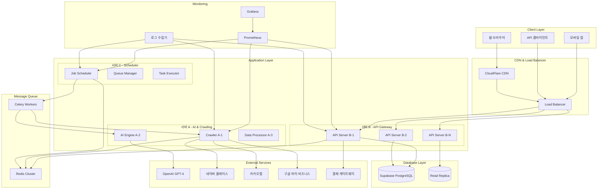

## 🖥️ 서버별 상세 아키텍처

### 🔌 서버 B - API Gateway & User Management

**역할**: 사용자 요청 처리, 인증, 매장 관리, 결제 처리

#### 기술 스택
- **Framework**: FastAPI 0.104+
- **Database ORM**: SQLAlchemy 2.0 (Async)
- **Authentication**: Supabase Auth + JWT
- **Validation**: Pydantic V2
- **Documentation**: OpenAPI/Swagger

#### 내부 구조
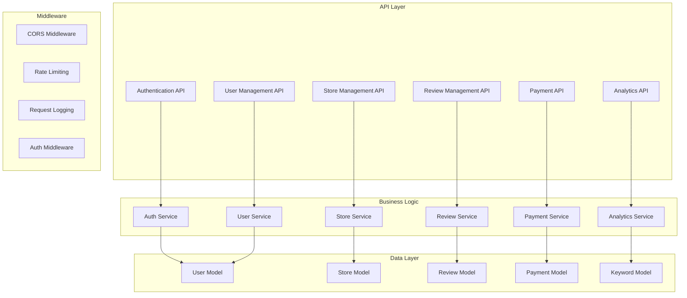

#### API 엔드포인트 구조
```
/api/v1/
├── auth/
│   ├── login
│   ├── register
│   ├── refresh
│   └── logout
├── users/
│   ├── me
│   ├── settings
│   └── subscription
├── stores/
│   ├── / (CRUD)
│   ├── {id}/stats
│   └── {id}/crawl
├── reviews/
│   ├── / (조회/필터링)
│   ├── {id}/reply
│   └── {id}/check-complete
├── analytics/
│   ├── dashboard
│   ├── trends/rating
│   ├── keywords
│   └── recommendations
└── payments/
    ├── plans
    ├── subscription
    ├── history
    └── methods
```

### 🤖 서버 A - AI & Crawling Engine

**역할**: 리뷰 크롤링, AI 답글 생성, 감정 분석

#### 기술 스택
- **Framework**: FastAPI + Asyncio
- **Crawling**: Playwright (Multi-browser)
- **AI**: OpenAI GPT-4, 사용자 정의 프롬프트
- **Queue**: Celery + Redis
- **Monitoring**: 실시간 성능 추적

#### 크롤링 아키텍처
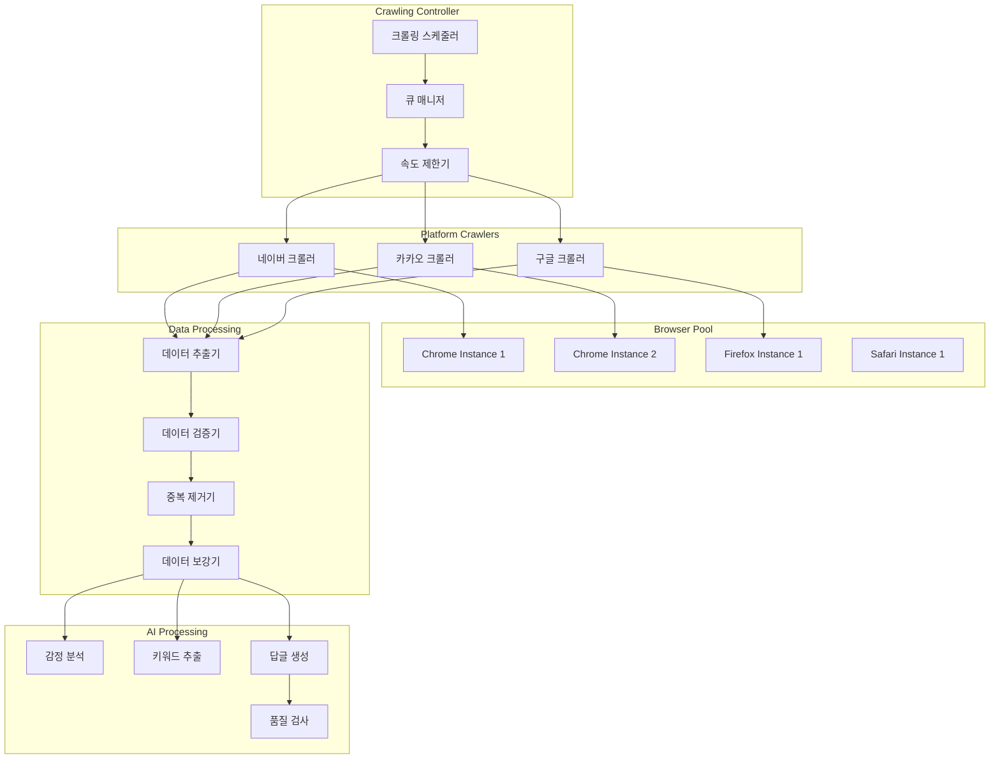

#### AI 답글 생성 파이프라인
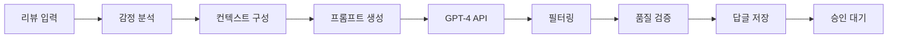

### ⏰ 서버 C - Task Scheduler & Automation

**역할**: 배치 작업 스케줄링, 자동화 워크플로우, 시스템 모니터링

#### 기술 스택
- **Scheduler**: Celery Beat + Redis
- **Task Queue**: Celery Workers
- **Monitoring**: Flower (Celery 모니터링)
- **Automation**: 사용자 정의 워크플로우

#### 스케줄링 아키텍처
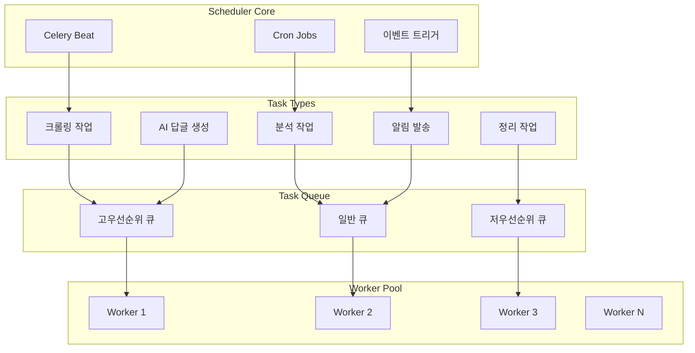

#### 자동화 워크플로우
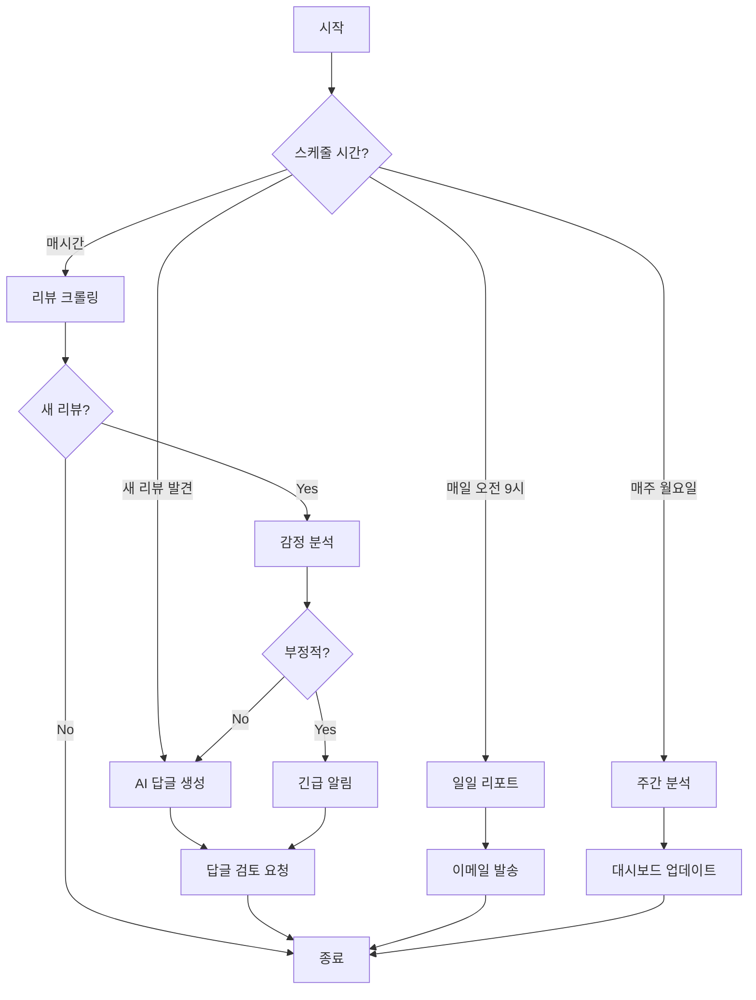

## 💾 데이터 아키텍처

### 데이터베이스 설계

#### 주 데이터베이스 (Supabase PostgreSQL)
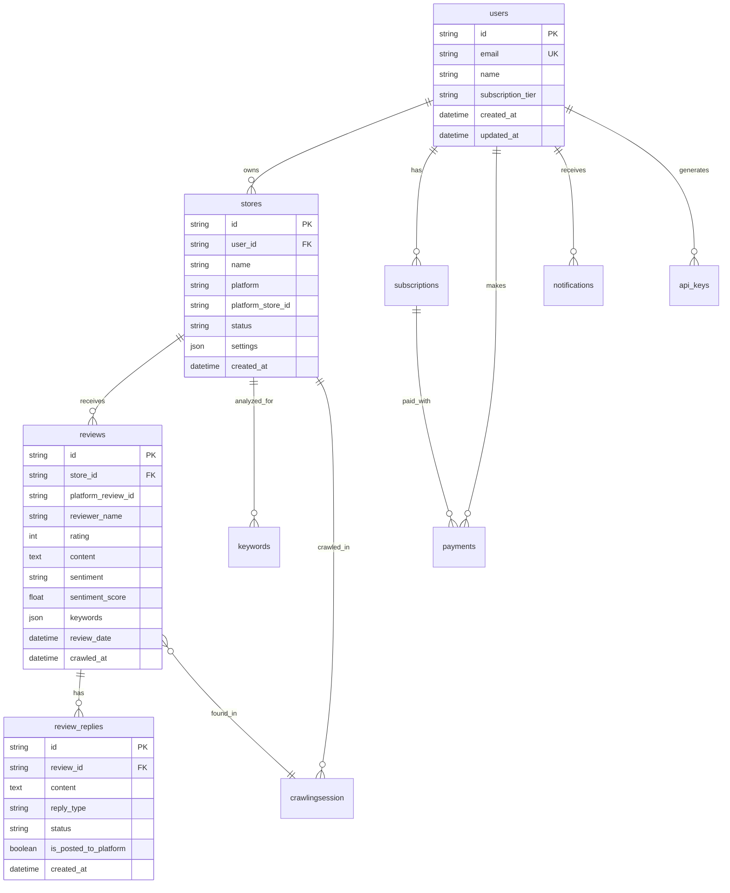

#### 데이터 파티셔닝 전략
```sql
-- 리뷰 테이블 월별 파티셔닝
CREATE TABLE reviews_2024_08 PARTITION OF reviews
FOR VALUES FROM ('2024-08-01') TO ('2024-09-01');

-- 크롤링 세션 일별 파티셔닝
CREATE TABLE crawlingsession_daily PARTITION OF crawlingsession
FOR VALUES FROM ('2024-08-13') TO ('2024-08-14');
```

#### 인덱스 최적화
```sql
-- 복합 인덱스 (성능 최적화)
CREATE INDEX idx_reviews_store_date ON reviews(store_id, review_date DESC);
CREATE INDEX idx_keywords_store_trend ON keywords(store_id, is_trending, this_week_count DESC);
CREATE INDEX idx_notifications_user_unread ON notifications(user_id, is_read) WHERE is_read = false;

-- 부분 인덱스 (저장 공간 최적화)
CREATE INDEX idx_reviews_negative ON reviews(store_id, sentiment_score) WHERE sentiment_score < -0.3;
```

### 캐싱 전략

#### Redis 캐시 계층
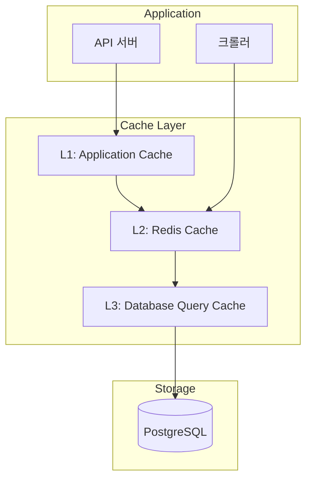

#### 캐시 정책
```yaml
cache_policies:
  user_session:
    ttl: 3600  # 1시간
    type: "string"
    pattern: "session:{user_id}"
  
  store_stats:
    ttl: 1800  # 30분
    type: "hash"
    pattern: "stats:{store_id}:{date}"
  
  api_rate_limit:
    ttl: 60    # 1분
    type: "counter"
    pattern: "rate:{ip}:{endpoint}"
  
  crawling_lock:
    ttl: 3600  # 1시간
    type: "lock"
    pattern: "crawl:{store_id}"
```

## 🔒 보안 아키텍처

### 다중 계층 보안

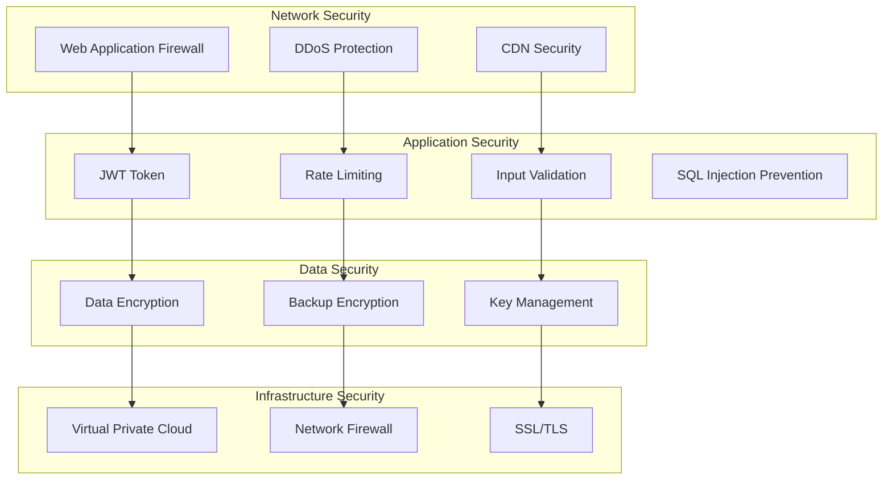

### 인증 및 권한 시스템

#### JWT 토큰 구조
```json
{
  "header": {
    "alg": "HS256",
    "typ": "JWT"
  },
  "payload": {
    "user_id": "uuid",
    "email": "user@example.com",
    "subscription_tier": "premium",
    "permissions": ["read", "write", "admin"],
    "iat": 1692000000,
    "exp": 1692003600
  }
}
```

#### 권한 매트릭스
| 역할 | 매장 관리 | 리뷰 답글 | 분석 조회 | 결제 관리 | 시스템 설정 |
|------|-----------|-----------|-----------|-----------|-------------|
| **Free** | 1개 | ❌ | 기본 | ❌ | ❌ |
| **Basic** | 3개 | ✅ | 기본 | ✅ | ❌ |
| **Premium** | 10개 | ✅ | 고급 | ✅ | ❌ |
| **Enterprise** | 무제한 | ✅ | 전체 | ✅ | ✅ |
| **Admin** | 무제한 | ✅ | 전체 | ✅ | ✅ |

## 📊 성능 및 확장성

### 성능 목표

| 메트릭 | 목표 | 현재 | 측정 방법 |
|--------|------|------|-----------|
| **API 응답 시간** | < 200ms | TBD | P95 레이턴시 |
| **동시 사용자** | 10,000명 | TBD | 로드 테스트 |
| **크롤링 처리량** | 3,000/시간 | TBD | 수집 메트릭 |
| **데이터베이스 쿼리** | < 50ms | TBD | 평균 쿼리 시간 |
| **가용성** | 99.9% | TBD | 업타임 모니터링 |

### 확장성 전략

#### 수평 확장 (Scale Out)
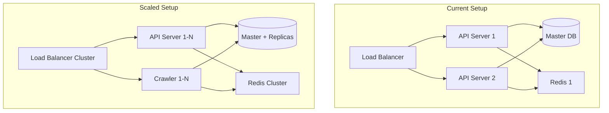

#### 수직 확장 (Scale Up)
```yaml
server_specs:
  development:
    cpu: "2 cores"
    memory: "4GB"
    storage: "50GB SSD"
  
  production_small:
    cpu: "4 cores"
    memory: "16GB"
    storage: "200GB SSD"
  
  production_large:
    cpu: "16 cores"
    memory: "64GB"
    storage: "1TB NVMe"
  
  enterprise:
    cpu: "32 cores"
    memory: "128GB"
    storage: "2TB NVMe"
```

## 🔄 데이터 흐름

### 실시간 데이터 파이프라인

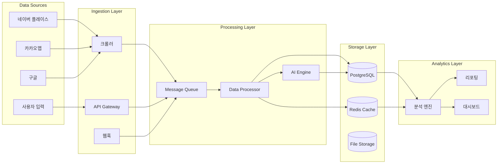

### 배치 처리 워크플로우

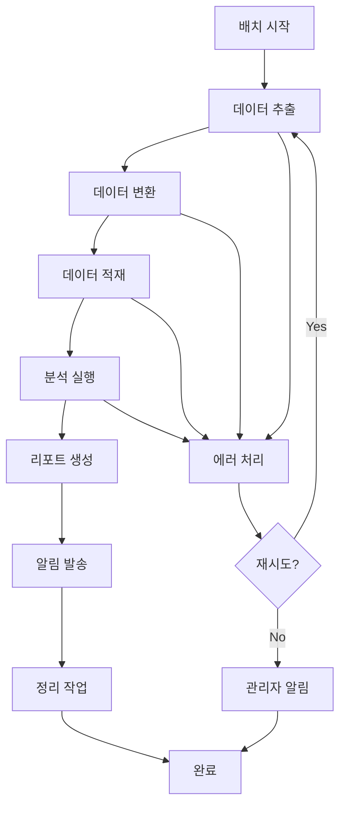

## 🚨 장애 대응 및 복구

### 장애 시나리오 및 대응

| 장애 유형 | 감지 시간 | 복구 목표 | 대응 방법 |
|-----------|-----------|-----------|-----------|
| **API 서버 다운** | < 1분 | < 5분 | 로드밸런서 자동 라우팅 |
| **데이터베이스 장애** | < 2분 | < 10분 | 읽기 전용 모드 + 복제본 승격 |
| **크롤링 서비스 중단** | < 5분 | < 30분 | 백업 크롤러 활성화 |
| **외부 API 장애** | < 10분 | 외부 복구 시까지 | 캐시된 데이터 사용 |

### 백업 및 복구 전략

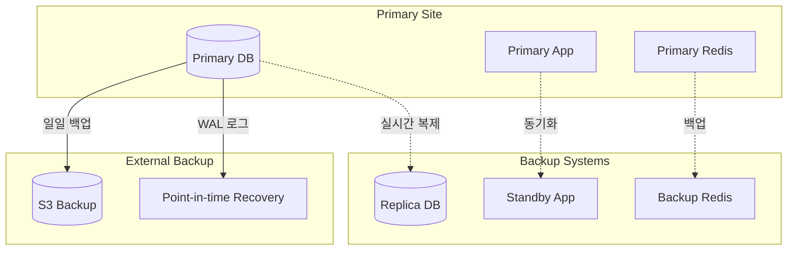

---

*상세한 구현 가이드는 [개발 가이드](DEVELOPMENT_GUIDE.md) 및 [배포 가이드](DEPLOYMENT.md)를 참조하세요.*