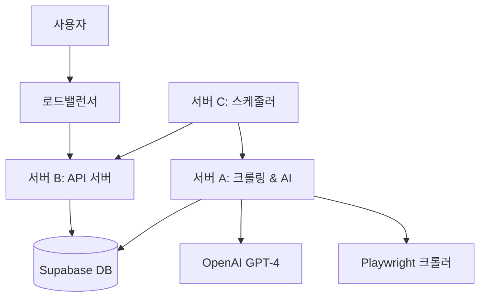

# 📋 우리가게 도우미 - 프로젝트 개요

## 🎯 프로젝트 비전

**"모든 소상공인이 온라인 평판 관리를 쉽고 효율적으로 할 수 있도록 돕는다"**

## 🚀 프로젝트 목적

### 해결하고자 하는 문제

**소상공인의 온라인 리뷰 관리 어려움:**
- 💼 **시간 부족**: 리뷰 확인과 답글 작성에 많은 시간 소요
- 🤷 **전문성 부족**: 적절한 답글 작성 방법을 모름
- 📱 **기술적 장벽**: 여러 플랫폼을 개별적으로 관리해야 함
- 📊 **데이터 활용 부족**: 리뷰 데이터를 분석하여 개선점을 찾기 어려움

### 제공하는 솔루션

**AI 기반 통합 리뷰 관리 플랫폼:**
- 🤖 **자동화된 AI 답글 생성**: GPT-4 기반 상황별 맞춤 답글
- 📊 **실시간 분석 대시보드**: 평점, 키워드, 트렌드 분석
- 🔄 **24시간 자동 크롤링**: 네이버, 카카오, 구글 리뷰 자동 수집
- 📱 **QR 코드 리뷰 유도**: 고객이 쉽게 리뷰를 남길 수 있는 시스템

## 🎯 핵심 기능

### 1. 🤖 AI 리뷰 답글 자동 생성
- **감정 분석**: 긍정/부정/중립 자동 분류
- **맞춤형 답글**: 매장 톤앤매너에 맞는 답글 생성
- **키워드 추출**: 중요 키워드 자동 식별
- **승인 시스템**: 사장님 검토 후 자동 게시

### 2. 📊 리뷰 분석 대시보드
- **실시간 통계**: 평점, 리뷰 수, 답글률 모니터링
- **트렌드 분석**: 시간별, 요일별 리뷰 패턴 분석
- **경쟁사 비교**: 업종별 평균 대비 매장 성과
- **개선 제안**: AI 기반 매장 개선점 추천

### 3. 🔍 자동 리뷰 크롤링
- **멀티 플랫폼**: 네이버 플레이스, 카카오맵, 구글 마이 비즈니스
- **실시간 수집**: 24시간 자동 모니터링
- **중복 제거**: 동일 리뷰 자동 필터링
- **이미지 수집**: 리뷰 이미지도 함께 저장

### 4. 📱 QR 코드 리뷰 시스템
- **리뷰 초안 생성**: 고객이 쉽게 작성할 수 있는 템플릿 제공
- **다국어 지원**: 한국어, 영어, 중국어, 일본어
- **인센티브 연동**: 리뷰 작성 시 할인 쿠폰 제공
- **매장별 커스터마이징**: 업종에 맞는 질문 템플릿

## 🏗️ 시스템 아키텍처 개요

### 마이크로서비스 구조

### 주요 구성요소

| 서버 | 역할 | 기술스택 | 상태 |
|------|------|----------|------|
| **서버 A** | 크롤링 & AI 답글 생성 | Python, Playwright, OpenAI | ⏳ 대기 |
| **서버 B** | 사용자 API & 매장 관리 | FastAPI, SQLAlchemy | ✅ 90% 완료 |
| **서버 C** | 스케줄러 & 배치 작업 | Celery, Redis, Cron | ⏳ 대기 |

## 📊 타겟 성능 지표

### 기술적 목표
- **동시 사용자**: 10,000명
- **크롤링 처리량**: 시간당 3,000개 리뷰
- **API 응답 시간**: 평균 200ms 이하
- **가용성**: 99.9% (월 8.7시간 이하 다운타임)
- **AI 답글 생성**: 3초 이내

### 비즈니스 목표
- **사용자 만족도**: 4.5/5.0 이상
- **리뷰 답글률 개선**: 평균 300% 증가
- **매장 평점 개선**: 평균 0.3점 증가
- **사용자 유지율**: 월 90% 이상

## 💰 수익 모델

### 구독 플랜

| 플랜 | 월 요금 | 매장 수 | 월간 리뷰 | 주요 기능 |
|------|---------|---------|-----------|-----------|
| **무료 체험** | ₩0 | 1개 | 10개 | 기본 분석, 이메일 지원 |
| **베이직** | ₩29,000 | 3개 | 100개 | AI 답글, 기본 리포트 |
| **프리미엄** | ₩99,000 | 10개 | 500개 | 고급 분석, 경쟁사 비교 |
| **엔터프라이즈** | ₩299,000 | 무제한 | 무제한 | API 접근, 전담 매니저 |

### 예상 월 운영비용
- **서버 인프라**: ₩1,375,000 (AWS/GCP)
- **AI API (OpenAI)**: ₩500,000
- **기타 서비스**: ₩200,000
- **총 운영비**: ₩2,075,000

## 📈 개발 로드맵

### Phase 1: MVP 구축 (2024년 8월)
- ✅ 데이터베이스 설계 완료
- 🔄 API 서버 개발 (90%)
- ⏳ 프론트엔드 기본 UI
- ⏳ 네이버 플레이스 크롤링

### Phase 2: 핵심 기능 (2024년 9월)
- ⏳ AI 답글 생성 시스템
- ⏳ 리뷰 분석 대시보드
- ⏳ 사용자 인증 시스템
- ⏳ 결제 시스템 연동

### Phase 3: 고도화 (2024년 10월)
- ⏳ 카카오맵, 구글 크롤링 확장
- ⏳ QR 코드 시스템
- ⏳ 모바일 앱 개발
- ⏳ 고급 분석 기능

### Phase 4: 서비스 출시 (2024년 11월)
- ⏳ 베타 테스트
- ⏳ 성능 최적화
- ⏳ 보안 강화
- ⏳ 상용 서비스 오픈

## 🎯 핵심 성공 요소

### 기술적 요소
1. **안정적인 크롤링**: 플랫폼 정책 변경에 유연하게 대응
2. **정확한 AI 답글**: 매장 특성과 상황에 맞는 답글 생성
3. **실시간 처리**: 대용량 데이터의 실시간 분석 및 알림
4. **확장 가능한 아키텍처**: 사용자 증가에 대응하는 시스템

### 비즈니스 요소
1. **사용자 경험**: 직관적이고 쉬운 인터페이스
2. **가격 경쟁력**: 합리적인 구독료와 명확한 가치 제공
3. **고객 지원**: 빠른 응답과 전문적인 지원
4. **마케팅 전략**: 소상공인 커뮤니티 내 입소문 확산

## 🚧 주요 위험 요소 및 대응책

### 기술적 위험
- **플랫폼 정책 변경**: 백업 크롤링 방식 준비
- **AI API 비용 급증**: 자체 모델 개발 로드맵
- **서버 과부하**: 오토스케일링 및 CDN 활용

### 비즈니스 위험
- **경쟁사 등장**: 차별화된 기능과 서비스 품질로 대응
- **시장 변화**: 지속적인 고객 피드백 수집 및 개선
- **법적 이슈**: 개인정보보호법 및 관련 규정 철저 준수

---

*프로젝트 상세 정보는 [시스템 아키텍처](SYSTEM_ARCHITECTURE.md) 및 [개발 가이드](DEVELOPMENT_GUIDE.md)를 참조하세요.*