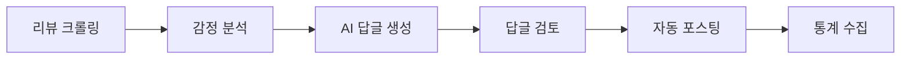

# 🤖 네이버 답글 시스템

네이버 플레이스의 리뷰에 자동으로 답글을 작성하고 관리하는 시스템입니다.

## 📄 문서 목록

- **[시스템 요약](NAVER_REPLY_SYSTEM_SUMMARY.md)**
  - 전체 시스템 개요
  - 주요 기능 설명
  - 아키텍처 다이어그램
  - 기술 스택

- **[답글 포스팅](README_reply_posting.md)**
  - 자동 답글 작성 프로세스
  - AI 답글 생성 로직
  - 포스팅 자동화
  - 에러 처리

- **[통계 수집](README_statistics.md)**
  - 리뷰 통계 수집
  - 데이터 분석
  - 리포트 생성
  - 대시보드 연동

## 🔄 시스템 워크플로우



## 🚀 주요 기능

### 1. 리뷰 모니터링
- 실시간 리뷰 감지
- 키워드 필터링
- 우선순위 설정

### 2. AI 답글 생성
- GPT-4 기반 답글 생성
- 감정 맞춤형 응답
- 브랜드 톤 유지

### 3. 자동 포스팅
- 네이버 로그인 자동화
- 답글 자동 작성
- 스케줄링 지원

### 4. 통계 및 분석
- 답글 효과 분석
- 고객 감정 트렌드
- 응답률 통계

## ⚙️ 설정

### 환경 변수
```env
NAVER_ID=your_naver_id
NAVER_PW=your_naver_password
OPENAI_API_KEY=your_openai_key
```

### 실행 방법
```bash
# 답글 시스템 시작
python naver_reply_poster.py

# 통계 수집 시작
python naver_statistics_crawler.py
```

## 🔗 관련 문서
- [백엔드 메인](../README.md)
- [API 통합 가이드](../api_integration_guide.md)
- [비동기 작업 가이드](../async_jobs_guide.md)