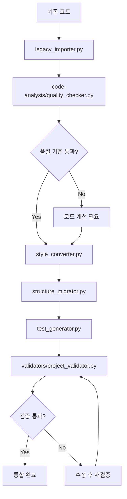
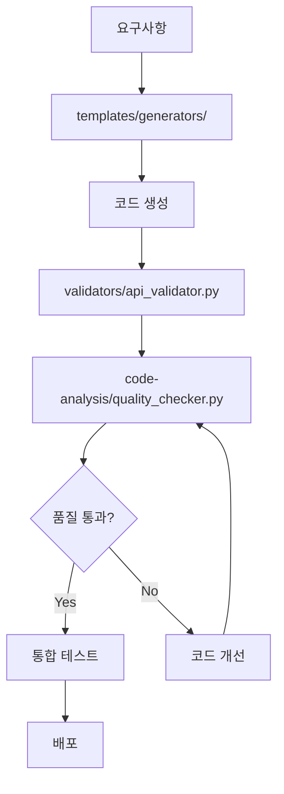

# 🛠️ Development Tools & Scripts

## 📋 개요

프로젝트 개발을 위한 도구, 스크립트, 템플릿들을 모아둔 개발자 도구 모음입니다.

## 📁 폴더 구조

### 🔍 code-analysis/
**용도**: 코드 품질 분석 및 메트릭 수집 도구

```
code-analysis/
├── quality_checker.py      # 코드 품질 종합 분석
├── dependency_analyzer.py  # 의존성 분석 도구
├── security_scanner.py     # 보안 취약점 스캔
├── performance_profiler.py # 성능 프로파일링
├── complexity_meter.py     # 코드 복잡도 측정
└── test_coverage.py        # 테스트 커버리지 분석
```

**주요 기능**:
- 코드 복잡도 (Cyclomatic Complexity) 측정
- 코딩 스타일 검사 (PEP8, ESLint)
- 중복 코드 탐지
- 보안 취약점 스캔
- 성능 병목 지점 식별
- 테스트 커버리지 리포트

### 🔄 migration-scripts/
**용도**: 기존 코드를 현재 프로젝트로 마이그레이션하는 스크립트

```
migration-scripts/
├── legacy_importer.py      # 기존 코드 자동 import
├── style_converter.py      # 코딩 스타일 자동 변환
├── structure_migrator.py   # 프로젝트 구조 마이그레이션
├── dependency_updater.py   # 의존성 업데이트
├── test_generator.py       # 테스트 코드 자동 생성
└── doc_generator.py        # 문서 자동 생성
```

**주요 기능**:
- 기존 코드 자동 스캔 및 분류
- 코딩 스타일 자동 변환 (Black, Prettier)
- 프로젝트 구조에 맞게 파일 재배치
- 의존성 충돌 해결 및 업데이트
- 기본 테스트 케이스 자동 생성

### ✅ validators/
**용도**: 코드 및 설정 검증 도구

```
validators/
├── api_validator.py        # API 스펙 검증
├── db_schema_validator.py  # 데이터베이스 스키마 검증
├── config_validator.py     # 설정 파일 검증
├── env_validator.py        # 환경 변수 검증
├── docker_validator.py     # Docker 설정 검증
└── security_validator.py   # 보안 설정 검증
```

**주요 기능**:
- OpenAPI 스펙 호환성 검사
- 데이터베이스 스키마 일관성 검증
- 환경 설정 필수 항목 체크
- Docker 이미지 보안 스캔
- API 엔드포인트 응답 검증

### 📋 templates/
**용도**: 새로운 컴포넌트 생성을 위한 템플릿

```
templates/
├── generators/             # 코드 생성기
│   ├── api_generator.py    # API 엔드포인트 생성기
│   ├── model_generator.py  # 데이터 모델 생성기
│   ├── test_generator.py   # 테스트 케이스 생성기
│   └── component_generator.py # React 컴포넌트 생성기
├── boilerplates/          # 보일러플레이트 코드
│   ├── fastapi_endpoint.py
│   ├── pydantic_model.py
│   ├── react_component.tsx
│   └── test_template.py
└── configs/               # 설정 템플릿
    ├── docker-compose.template.yml
    ├── nginx.template.conf
    └── github-workflow.template.yml
```

## 🚀 주요 도구 사용법

### 1. 코드 품질 분석
```bash
# 전체 프로젝트 품질 분석
python tools/code-analysis/quality_checker.py --path backend/server-b/

# 보안 취약점 스캔
python tools/code-analysis/security_scanner.py --scan-all

# 성능 프로파일링
python tools/code-analysis/performance_profiler.py --profile api
```

### 2. 기존 코드 마이그레이션
```bash
# 기존 크롤러 코드 import
python tools/migration-scripts/legacy_importer.py \
  --source /path/to/old/crawler \
  --target legacy/original-code/crawlers/ \
  --category crawler

# 코딩 스타일 자동 변환
python tools/migration-scripts/style_converter.py \
  --input legacy/original-code/crawlers/naver-crawler \
  --output legacy/adapted/components/crawlers/

# 테스트 코드 자동 생성
python tools/migration-scripts/test_generator.py \
  --source legacy/adapted/components/crawlers/naver_crawler.py \
  --output tests/unit/test_naver_crawler.py
```

### 3. 새 컴포넌트 생성
```bash
# API 엔드포인트 생성
python tools/templates/generators/api_generator.py \
  --name "Store Analytics" \
  --path "analytics/stores" \
  --output backend/server-b/app/api/

# React 컴포넌트 생성  
python tools/templates/generators/component_generator.py \
  --name "StoreCard" \
  --type "display" \
  --output frontend/src/components/

# 데이터 모델 생성
python tools/templates/generators/model_generator.py \
  --name "AnalyticsReport" \
  --fields "store_id:str,period:str,metrics:dict" \
  --output backend/server-b/app/models/
```

### 4. 프로젝트 검증
```bash
# 전체 프로젝트 검증
python tools/validators/project_validator.py --validate-all

# API 스펙 검증
python tools/validators/api_validator.py \
  --spec backend/server-b/openapi.json \
  --test-endpoints

# 환경 설정 검증
python tools/validators/env_validator.py \
  --env .env.example \
  --check-required
```

## 🔧 도구 설정

### 환경 설정
```bash
# 도구 의존성 설치
cd tools/
pip install -r requirements.txt

# 설정 파일 생성
cp config.example.yml config.yml
```

### 설정 파일 예시
```yaml
# tools/config.yml
analysis:
  quality:
    max_complexity: 10
    min_coverage: 80
    style_guide: "pep8"
  
  security:
    exclude_patterns:
      - "*/tests/*"
      - "*/migrations/*"
    
migration:
  style:
    python_formatter: "black"
    js_formatter: "prettier"
    max_line_length: 88
  
  structure:
    preserve_history: true
    backup_original: true

validation:
  api:
    timeout: 30
    retry_count: 3
  
  database:
    check_constraints: true
    validate_indexes: true

templates:
  author: "Store Helper Team"
  license: "MIT"
  default_lang: "python"
```

## 📊 도구 활용 워크플로우

### 기존 코드 통합 워크플로우


### 신규 개발 워크플로우


## 📈 자동화 스크립트

### CI/CD 통합
```bash
#!/bin/bash
# tools/scripts/ci_check.sh

echo "🔍 코드 품질 검사 시작..."
python tools/code-analysis/quality_checker.py --path . --format json > quality_report.json

echo "🛡️ 보안 스캔 시작..."
python tools/code-analysis/security_scanner.py --output security_report.json

echo "✅ 프로젝트 검증 시작..."
python tools/validators/project_validator.py --validate-all

echo "📊 테스트 커버리지 확인..."
python tools/code-analysis/test_coverage.py --min-coverage 80

echo "✅ 모든 검사 완료!"
```

### 개발 환경 설정 스크립트
```bash
#!/bin/bash
# tools/scripts/setup_dev.sh

echo "🛠️ 개발 환경 설정 시작..."

# 도구 의존성 설치
cd tools && pip install -r requirements.txt

# 설정 파일 생성
if [ ! -f config.yml ]; then
    cp config.example.yml config.yml
    echo "📝 설정 파일이 생성되었습니다. tools/config.yml을 확인하세요."
fi

# Git hooks 설정
cp scripts/pre-commit ../.git/hooks/
chmod +x ../.git/hooks/pre-commit

echo "✅ 개발 환경 설정 완료!"
```

## 📞 도구 사용 가이드

### 팀 내 사용 규칙
1. **코드 커밋 전**: 반드시 `quality_checker.py` 실행
2. **새 컴포넌트 생성**: 템플릿 생성기 사용 권장
3. **기존 코드 통합**: 마이그레이션 워크플로우 준수
4. **문제 발생 시**: 검증 도구로 원인 분석

### 트러블슈팅
- **도구 실행 오류**: `requirements.txt` 재설치
- **설정 문제**: `config.yml` 확인
- **권한 문제**: 스크립트 실행 권한 확인
- **의존성 충돌**: 가상환경에서 실행

---

*이 도구들은 개발 효율성과 코드 품질 향상을 위해 만들어졌습니다.*